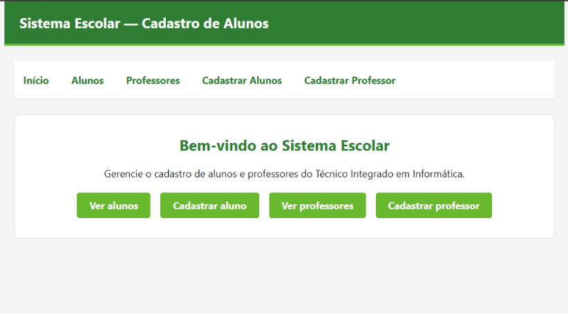
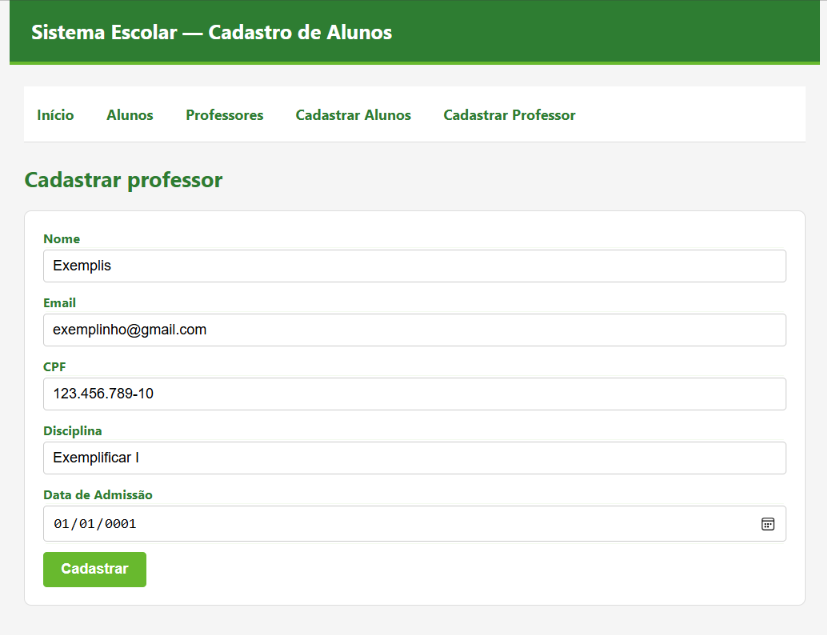
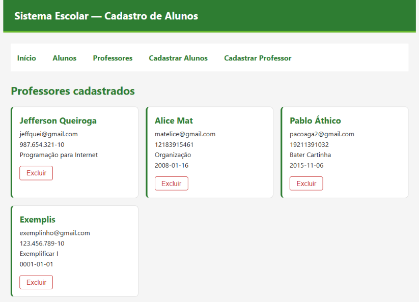

# Sistema Escolar — Cadastro de Professores

Cadastro de professores com listagem, cadastro e exclusão, feito em React + Vite consumindo uma API simulada com json-server.

Projeto da disciplina de Programação para Internet — IFRN Campus Pau dos Ferros.

## Funcionalidades

- **Cadastrar professor** com nome, e-mail, CPF, disciplina e data de admissão.
- **Listar professores** cadastrados em cards.
- **Excluir professor** diretamente pelo card.
- Navegação entre as páginas com React Router.
- Mensagem de erro na tela caso a API (json-server) não esteja rodando.

## Pré-requisitos

- [Node.js](https://nodejs.org/) instalado (confira com `node -v` no terminal).

## Como baixar o projeto

1. Baixe o projeto pelo GitHub: **<https://github.com/grazysss/sistema-escolar-react>**
   - Pelo navegador: entre no link, clique em **Code > Download ZIP** e extraia a pasta.
   - Ou, se tiver o Git instalado, rode no terminal (PowerShell):

```
git clone https://github.com/grazysss/sistema-escolar-react.git
```

2. Abra a pasta do projeto no VS Code (ou no terminal, navegue até ela com `cd`).

## Como instalar as dependências

No terminal, dentro da pasta do projeto, rode:

```
npm install
```

## Como rodar o projeto

Este projeto precisa de **dois terminais abertos ao mesmo tempo** — um para a API simulada e outro para a aplicação React.

**Terminal 1 — API simulada (json-server):**

```
npx json-server --watch db.json --port 3000
```

**Terminal 2 — aplicação React (Vite):**

```
npm run dev
```

Depois, abra no navegador o endereço mostrado no terminal (geralmente `http://localhost:5173`).

> Se aparecer uma mensagem de erro de conexão na tela, confira se o Terminal 1 (json-server) ainda está rodando.

## Rotas da aplicação

| Rota                  | Página                                      |
| --------------------- | ------------------------------------------- |
| `/`                   | Página inicial                              |
| `/professores`        | Listagem de professores                     |
| `/cadastroprofessor`  | Formulário de cadastro de professor         |

## Endpoints da API (json-server)

| Método | Endpoint          | Ação                      |
| ------ | ----------------- | ------------------------- |
| GET    | `/professor`      | Lista todos os professores |
| POST   | `/professor`      | Cadastra um professor      |
| DELETE | `/professor/:id`  | Exclui um professor        |

## Screenshots

### Página inicial

Página inicial com as opções **Ver professores** e **Cadastrar professor**.

<!-- Cole aqui o print da página inicial -->


### Cadastrar professor

Formulário de cadastro de um novo professor.

<!-- Cole aqui o print da tela de cadastro -->


### Professores

Listagem dos professores cadastrados.

<!-- Cole aqui o print da tela de listagem -->


## Autora

Projeto desenvolvido por [grazysss](https://github.com/grazysss).